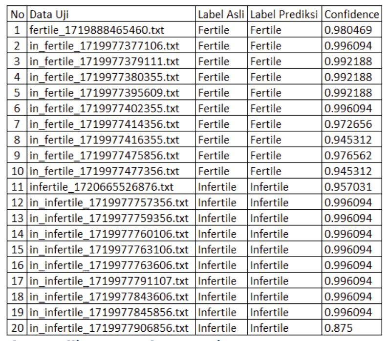

# Object-Based Automatic Fertile and Infertile Egg Detection Tool Detection

# Background
Eggs are essential commodities in Indonesia with high demand, requiring consistent quality and supply. Traditional egg fertility checks through candling are manual, slow, and prone to inconsistencies. This project introduces an automated system utilizing the FOMO MobileNetV2 algorithm on Raspberry Pi 5 to classify fertile and infertile eggs efficiently and accurately. The solution ensures high-quality egg production while enhancing operational efficiency in poultry farms, supporting Indonesia's egg supply chain sustainability.

### Research Problem Formulation
- Manual candling requires a trained and healthy eyes, making it hard for people who have eye problems.
- A single person can only do one egg at a time, can lead to time problem if the human resources isn’t enough.

### Goals
- Automate the candling process for eggs on a real-time cases  with a low-cost environment.
- Optimize time consume by ensuring a precise and efficient classification.
- Provide a user-friendly system with clear feedback.

### Solutions
- Integrate a Machine Learning (ML) to the concept of candling.
- Use an images that contains an egg in a candling-specific lighting condition.
- Employ a Raspberry Pi 5 to process data and apply ML to do classification.
- Use a monitor to display the information.

# Preparation
### Hardware Component
- **Raspberry Pi 5**: Microcontroller for processing data dan ML classification.
- **Raspberry Pi** Adapter: Powers the Raspberry Pi 5

### Schematics

### System Architect

### Design System

# Data Samples
You can use your own sample data for training and testing at Edge Impulse Studio (since this repo uses Edge Impulse), but you can look in the **Data Samples** folder.

### Train Data
- **train_data.npy**: numpy file containing data image information for training.
- **train_labels.json**: .json file containing the labels and bounding box data for training.
- **train_labels.csv**: .csv version from the train_labels.

### Test Data
- **test_data.npy**: numpy file containing data image information for training.
- **test_labels.json**: .json file containing the labels and bounding box data for training.
- **test_labels.csv**: .csv version from the train_labels.
  
# Deployment Steps
Because this project uses Edge Impulse, make sure training and testing comply with the documentation on Edge Impulse.

You can see the following example project to replicate it:
https://studio.edgeimpulse.com/public/571394/live

You can also directly use this project repo (look in the **class** folder) and follow the steps below:

### Steps
- Go to the Deployment page in the Edge Impulse project. Select C++ libraries. Scroll down, and click Build.

- Create a directory to hold the project. Unzip the C++ Library file into the project directory.
- If you use this repo, you can move the **class** folder into your Raspberry Pi's File Explorer. (This repo uses Debian Linux OS)
- File Structure:

**my-project/
|-- edge-impulse-sdk/
|-- model-parameters/
|-- tflite-model/
|-- CMakeLists.txt
|-- Makefile
|-- main.cpp**

- You can pay attention to the main.cpp file. This script will set up and call the model along with the required libraries. You can see this documentation to further customize as needed: https://docs.edgeimpulse.com/docs/run-inference/cpp-library/deploy-your-model-as-a-c-library
- You can use the Makefile and Make tool scripts to compile all the necessary source code, link the object files, and produce a single executable file
- Extract raw features from one of the testing sample files (grayscale features from the egg image). This could be done from the Edge Impulse project on **Image** tab

- Sample raw features: **0.0567, 0.0589, 0.0688, 0.0688, 0.0767, 0.0708, 0.0756, 0.0817, 0.0835, 0.0853, 0.0938,...**
- Put the raw feature results into the **input_buff** struct in main.cpp
- If you use this repo project, you can directly safe raw features into a .txt file and enter the file path into the terminal input later when run using the Make command. This will automatically put the raw features from the path into the input_buff struct.
- Open Terminal, navigate to the project directory, and run the make command using -j [jobs] to speed up multi-threaded processing
- Command: **cd my-project/make-j 4**
- Run the application when the build process is complete
- Command: **./build/app**

# Evaluation Result

### Result Output

### Metrics Result

# Conclusion
This project successfully concludes all goals, providing a low-cost automatic candling method with an easy to use system. This system achieved a high accuracy and fast computation time thanks to Raspberry Pi 5 which can reduces the time consume and the need of good eyesight.

